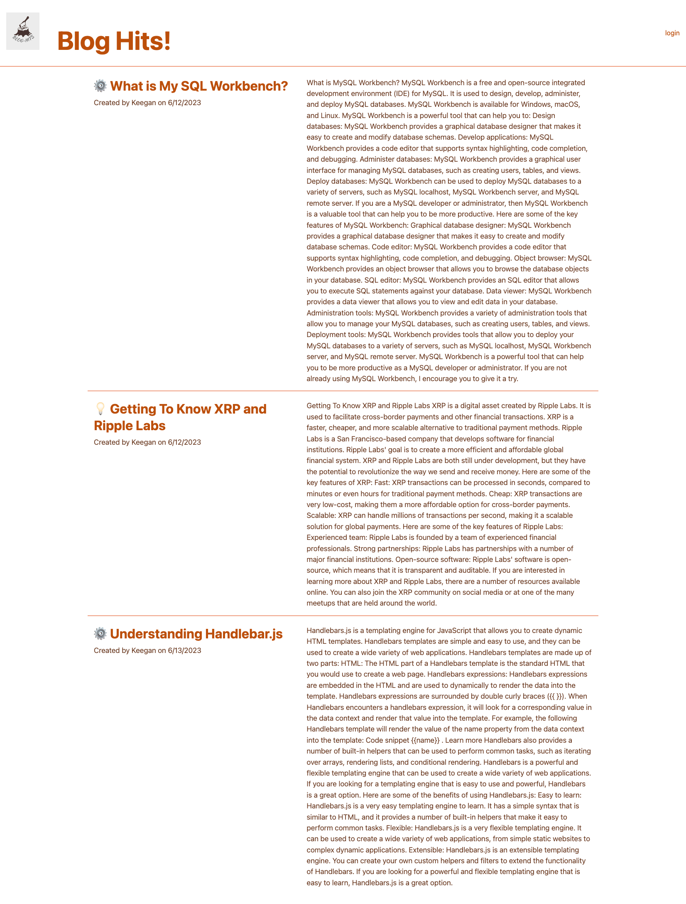
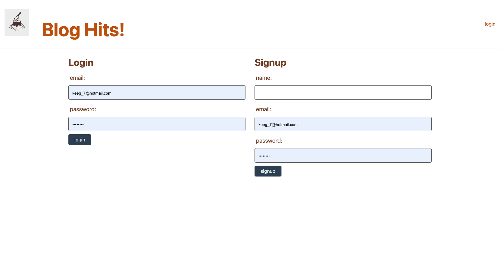
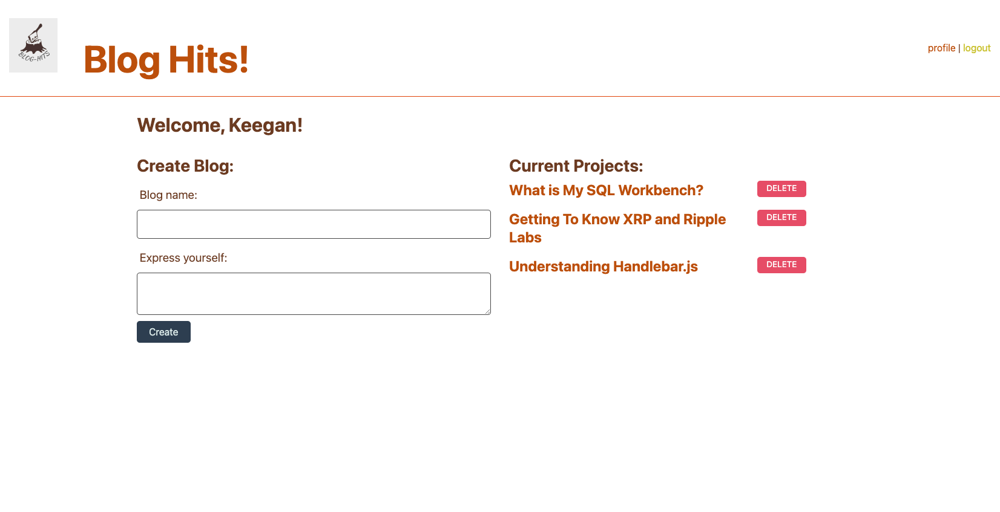
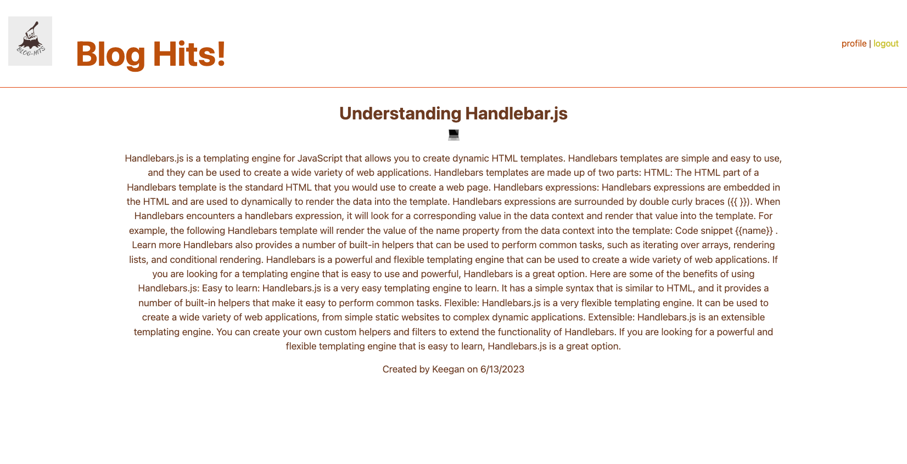

# Blog-Hits

## Description
Blog-Hits is a simple CMS-style blog site that allows developers to publish and read blog posts. It is built using the following technologies:

Node.js
Express
Handlebars.js
Sequelize
express-session

The blog site is easy to use and navigate. Developers can sign in to create their own blog posts, or they can read blog posts from other developers. Blog posts can be categorized and tagged, making it easy to find relevant content.

Blog-Hits is a great way for developers to share their knowledge and expertise with the world. It is also a great way for developers to learn from each other. If you are a developer, I encourage you to check out Blog-Hits.

## Installation

To get started, clone the repository and install the dependencies:

1. git clone https://github.com/[your-username]/blog-hits.git
2. cd blog-hits
3. npm install

Once the dependencies are installed, you can start the server:

node server.js

The server will start on port 3000. You can then access the blog site at http://localhost:3001.

To create a new blog post, sign in to the blog site and start blogging. To read other developers' blog posts, click on the "Blog" tab.

## Contributing

Contributions to the application are welcome and encouraged! If you wish to contribute to the project, please follow these steps:

1. Fork the repository and create a new branch for your feature or bug fix.
2. Make your modifications and ensure that the code adheres to the project's style and guidelines.
3. Write tests to validate the changes and ensure that the existing tests pass successfully.
4. Submit a pull request, providing a clear description of your changes and the problem they solve.
5. Engage in any necessary discussions or iterations to refine your contribution.
6. Once approved, your changes will be merged into the main codebase and become part of the application.

 By contributing to the project, you can help enhance its functionality, improve its performance, and fix issues. Your contributions can have a positive impact on the overall quality and usability of the application. Thank you for considering contributing to this project!

## License

MIT

## GitHub Link

https://github.com/Keegan-Omel/Blog-Hits

## Live Link

